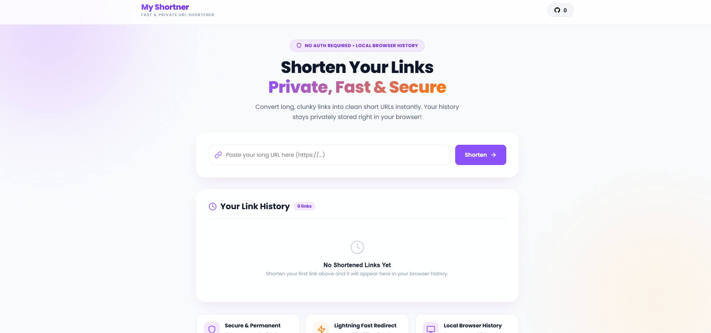

# 🔗 My Shortner - Modern PHP URL Shortener

A lightweight, fast, and feature-rich URL shortener built with **PHP**, **MySQL**, and modern UI aesthetics. It allows users to turn long URLs into short, trackable links with optional custom aliases and QR codes.

---

## 📷 Preview



---

## ✨ Features

- **⚡ Fast & Instant URL Shortening**: Instantly convert long links into short codes.
- **🎯 Custom Short Codes**: Choose custom aliases for your URLs.
- **📱 QR Code Generator**: Automatically generates QR codes for every shortened link.
- **📈 Click Counter & Analytics**: Tracks total clicks for each short link.
- **🎨 Glassmorphism UI**: Beautiful, modern, dark-themed responsive interface.
- **🛡️ Secure & Validated**: Input sanitization and duplicate detection.
- **🌐 HTTPS & Rewrite Rules**: Ready-to-use `.htaccess` configuration with rewrite rules and HTTPS forcing.

---

## 🛠️ Tech Stack & Requirements

- **PHP**: `>= 7.4` (PHP 8.x recommended)
- **Database**: MySQL / MariaDB
- **Dependency Manager**: [Composer](https://getcomposer.org/)
- **Web Server**: Apache (with `mod_rewrite` enabled) / XAMPP / WampServer

---

## 🚀 Quick Start & Installation

### 1. Clone the Repository
```bash
git clone https://github.com/rafidahmed870/my-shortner.git
cd my-shortner
```

### 2. Install PHP Dependencies via Composer
Make sure Composer is installed on your system, then run:
```bash
composer install
```

### 3. Setup Environment Variables
Duplicate `.env.example` to create `.env`:
```bash
cp .env.example .env
```
Edit `.env` file with your environment configurations:
```ini
# App Configuration
APP_NAME="My Shortner"
APP_URL="http://localhost/my-shortner"

# Database Configuration
DB_HOST=127.0.0.1
DB_NAME=short_url
DB_USER=root
DB_PASS=
```

### 4. Database Setup
1. Create a database named `short_url` in MySQL/phpMyAdmin.
2. Import the schema file located at `config/schema.sql`:
```bash
mysql -u root -p short_url < config/schema.sql
```
*Or import `config/schema.sql` via phpMyAdmin.*

---

## 📁 Directory Structure

```text
my-shortner/
├── assets/
│   ├── css/          # Custom stylesheets
│   ├── js/           # Frontend JavaScript logic
│   └── images/       # Static images & demo preview
├── config/
│   ├── config.php    # App initialization & DB connection
│   └── schema.sql    # Database table definition
├── functions/
│   └── helpers.php   # Core helper functions & URL logic
├── vendor/           # Composer packages (phpdotenv)
├── .env.example      # Environment variables template
├── .htaccess         # Apache rewrite & HTTPS redirect rules
├── 404.php           # Custom 404 error page
├── composer.json     # Composer dependencies
├── index.php         # Main application landing page
├── redirect.php      # URL redirect handler & click tracker
└── README.md         # Documentation
```

---

## ⚙️ Running Locally

### Using XAMPP / WampServer:
1. Place the `my-shortner` folder inside `htdocs` (e.g., `c:/xampp/htdocs/my-shortner`).
2. Start **Apache** and **MySQL** from XAMPP Control Panel.
3. Open `http://localhost/my-shortner` in your browser.

---

## 📄 License

This project is open-source and available under the [MIT License](LICENSE).
